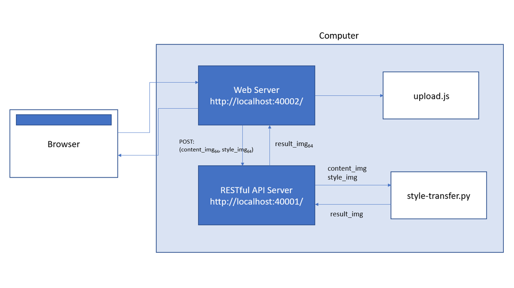
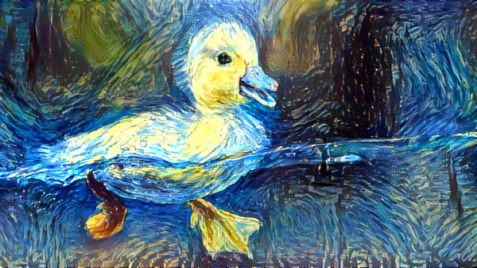

# How to build a webapp

We will be building a style-transfer web application with a React frontend and Flask backend.

---

## Overview

We want to create a website that can interpret the style of an uploaded image and transfer it to another uploaded image.

When we type the link corresponding to port 40002 the browser will initiate a request across the internet to our web server. The file _upload.js_ in src/ will be requested and the contents will be shown on our computer.

When we upload our content and style images and click submit, our browser will send a HTTP POST request to http://localhost:40002/style-transfer with the two images encoded to base64 stirngs. We will proxy any request ending with _/style-transfer_ to  http://localhost:40001/ so that the web server will direct the POST request to http://localhost:40001/style-transfer which is where our RESTful API server is being run on.

The server will then decode the base64 strings to images and call the style transfer code in <i>style-transfer.py</i> on the two images. The code returns the resulting image to the RESTful API server and the server sends the resulting image encoded in a base64 string back to the web server to be displayed along with contents in _upload.js_.



---

## What is style transfer?

[Style transfer](https://arxiv.org/abs/1508.06576) is a technique takes two images, a content image and a style image, and blends them together such that the resulting image has the same contents as the content image, but is "painted" in the style of the style image.

For example, let's take the content image of a duck and the style image of Vincent Van Gough's _Starry Night_:

 

If we "paint" the style of _Starry Night_ onto the duck image, then it would look something like this:



---

## Overall Setup

1. Run ```git clone https://github.com/angelayi/style-transfer-website.git``` to clone this repository into your machine.
2. Install [python 3.6.8](https://www.python.org/downloads/release/python-368/)
3. Press the windows key and type _Advanced system settings_ on your computer and click _Environment variables_
4. Under the _Path_ variable in _User variables_, click Edit, and add the path to your python folder (e.g. C:\Users\\[USERNAME]\AppData\Local\Programs\Python\Python36)

---

## RESTful Backend Module

We will start by creating the backend. RESTful API is an API that uses HTTP requests (GET, PUT, POST, DELETE) to retrieve, update, create, and delete data. We can use these HTTP requests to send and retrieve data from the backend. In our case, we will be making a POST request which receives two images (content and style) and returns an image with the style transferred to the content image.
We will be using [Flask](http://flask.pocoo.org/) to build a RESTful backend.

Navigate to the folder where you cloned your repository.

First, we will install the required libraries.

```console
pip install flask
pip install flask-restful
pip install flask_cors
```

Next, we look at the core logic file, _style_transfer.py_ which can be found on this [website](https://medium.com/tensorflow/neural-style-transfer-creating-art-with-deep-learning-using-tf-keras-and-eager-execution-7d541ac31398).
We will need to install the following libraries:

```console
pip install -U matplotlib
pip install Pillow
pip install ipython
```

Then, we will take a look at our Flask RESTful API file, which is called _api<i></i>.py_.

We do the following in this file:

1. We specify the port number to be 40001. This means that the Flask server will be handled on http://localhost:40001/.
2. Through the ```route()``` decorator, we tell Flask to handle our POST request on http://localhost:40001/style-transfer.
3. The POST request receives two images, the content image and the style image, in a base64 string format.
4. We decode the strings into an image and call the style transfer code to generate the resulting image.
5. We then encode the resulting image into a base64 string to return to the frontend.

Run ```python api.py``` to start a Flask server on http://localhost:40001/. You should see the following on your console:

```console
* Environment: production
* Debug mode: off
* Running on http://127.0.0.1:40001/ (Press CTRL+C to quit)
```

You may need to run ```dos2unix api.py``` before running ```python api.py```.

---

## React Frontend Module

We will create our frontend using React. To set up our environment, run the following commands:

```console
curl -sL https://deb.nodesource.com/setup_10.x | sudo -E bash -
sudo apt-get install -y nodejs

npm init react-app .
npm install
npm install axios
npm install --save react-router-dom
```

After that, we will take a look at our _upload.js_ file under the "src" folder.

We do the following in this file:

1. We created a React Component called ```ImageUpload```.
2. We initialized ```content_img_url``` and ```style_img_url``` as component states. These will store the resulting base64 string corresponding to each image.
3. We created the function ```postImages()``` which will later send our POST request to the Flask backend .We will use the [axios](https://github.com/axios/axios) library to send the HTTP request. We specify to send the request to a URL ending with _/style-transfer_.
4. We created the two functions ```getContentImage()``` and ```getStyleImage()``` which will take their respective image and convert it to a base64 string and store it in their state components.
5. We added HTML-like syntax into our render method to upload two images and press a SUBMIT button.
6. We rendered the React component ```ImageUpload``` into a HTML reference "root".

To start our server, we will run, ```npm start```. This will open our React frontend module on http://localhost:3000/.

However, we want our module on port 40002. To do this, in _package.json_, we have changed the ```"start"``` line under ```"scripts"``` to: ```"start": "PORT=40002 react-scripts start"```. You should see something similar to the following after running ```npm start```:

```console
You can now view test in the browser.

  Local:            http://localhost:40002/
  On Your Network:  http://127.0.0.1:40002/

Note that the deveopment build is not optimized.
To create a production build, use npm run build.
```

If you go to the link corresponding to port 40002, you will find two buttons for uploading images and a SUBMIT button.

---

## Connecting the Dots

Since our frontend and our backend are served from the same host but different ports, we can proxy any requests from our web server to our API server without having to hard code the server URL.

To do this, we will run the following command to install the proxy middleware:

```console
npm install http-proxy-middleware --save
```

Afterwards, we will create a _setupProxy.js_ file under the "src" folder with the following code to proxy all requests ending with _/style-transfer_ to our API server on port 40001.

---

## Running the website

To open our frontend and backend at the same time, we will run the script in _run<i></i>.sh_ which contains:

```console
nohup python api.py &
npm start
```

If we go to the link corresponding to port 40002, we will find our working website.
